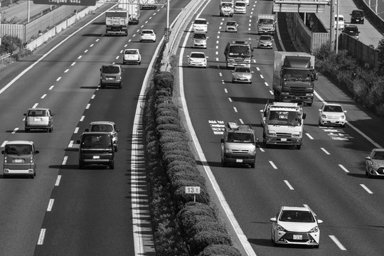
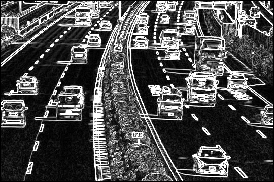

# sobel_edge_detector

Sobel フィルタによるエッジ検出を Rust で実装した学習用プログラムです。
入力画像をグレースケールに変換したうえで Sobel フィルタを適用し、輪郭を抽出した画像を出力します。

エッジ検出ライブラリは使わず、画素ループ・カーネル演算を自前で書いています。

## 処理の流れ

1. **画像の読み込み** — `image` クレートで画像を RGB8 として読み込む
2. **グレースケール化** — ITU-R BT.601 の輝度係数で加重平均する
   `Y = 0.299R + 0.587G + 0.114B`
   → `<入力ファイル名>_grayscale.png` として保存
3. **Sobel フィルタ適用** — 3×3 の近傍に対して横方向・縦方向のカーネルを畳み込み、勾配強度を求める
   → `<入力ファイル名>_edge.png` として保存

### Sobel カーネル

横方向の微分 `Gx` と縦方向の微分 `Gy`：

```
Gx = [-1  0  1]        Gy = [-1 -2 -1]
     [-2  0  2]             [ 0  0  0]
     [-1  0  1]             [ 1  2  1]
```

各画素の勾配強度は次式で求め、`0..=255` にクランプして出力します。

```
G = sqrt(Gx^2 + Gy^2)
```

カーネル演算には `ndarray` を使用しています（3×3 の要素積の総和として計算）。

## 実行結果の例

| 入力画像 | グレースケール化（中間結果） | エッジ検出結果 |
| --- | --- | --- |
|  |  |  |

## 必要環境

- Rust（edition 2024 を使うため、Rust 1.85 以降）
- cargo

## 使い方

```
sobel_edge_detector <入力画像パス> [出力ディレクトリ]
```

| 引数 | 必須 | 説明 |
| --- | --- | --- |
| `<入力画像パス>` | ○ | エッジ検出を行う画像のパス |
| `[出力ディレクトリ]` | | 結果の保存先。省略時は `processed_images`。存在しない場合は自動で作成する |

| オプション | 説明 |
| --- | --- |
| `-h`, `--help` | ヘルプを表示する |

### 実行例

```powershell
# 出力先を省略（processed_images/ に出力）
cargo run --release -- original_images/edge_detection_test.jpg

# 出力先を指定
cargo run --release -- original_images/photo.jpg output/photo

# ビルド済みバイナリを直接実行
.\target\release\sobel_edge_detector.exe original_images/photo.jpg

# ヘルプを表示
cargo run --release -- --help
```

`cargo run` に引数を渡す際は、`--` の後ろに書く点に注意してください。

### 出力ファイル

出力ファイル名は、入力ファイルの拡張子を除いた名前を接頭辞として組み立てられます。
そのため、複数の画像を同じディレクトリに出力しても結果が衝突しません。

```powershell
cargo run --release -- images/cat.jpg  results
cargo run --release -- images/dog.png  results
```

```
results/
├── cat_grayscale.png
├── cat_edge.png
├── dog_grayscale.png
└── dog_edge.png
```

- `<入力ファイル名>_grayscale.png` — グレースケール化した中間結果
- `<入力ファイル名>_edge.png` — エッジ検出の最終結果

同名のファイルが既にある場合は上書きされます。

### 終了コード

| コード | 意味 |
| --- | --- |
| 0 | 正常終了 |
| 1 | 引数の指定誤り、入力画像が存在しない・画像として読み込めない、出力ディレクトリの作成失敗、画像の保存失敗 |

エラー時は panic せず、標準エラー出力にメッセージを表示して終了します。

```
> cargo run --release -- notfound.jpg
エラー: 入力画像が見つかりません: notfound.jpg

> cargo run --release -- README.md
エラー: 画像の読み込みに失敗しました: README.md: The file extension `."md"` was not recognized as an image format
```

## ディレクトリ構成

```
sobel_edge_detector/
├── Cargo.toml
├── src/
│   ├── main.rs             # 引数の解析・出力パスの組み立て・エラー処理
│   └── edge_detection.rs   # グレースケール化・Sobel フィルタの実装
├── original_images/        # 入力画像のサンプル
│   └── edge_detection_test.jpg
└── processed_images/       # 出力画像（既定の出力先）
    ├── edge_detection_test_grayscale.png
    └── edge_detection_test_edge.png
```

## 依存クレート

| クレート | バージョン | 用途 |
| --- | --- | --- |
| [image](https://crates.io/crates/image) | 0.25 | 画像の読み込み・保存、ピクセルバッファ操作 |
| [ndarray](https://crates.io/crates/ndarray) | 0.17 | 3×3 カーネルの保持と要素積・総和の計算 |

引数解析は標準ライブラリの `std::env::args()`、エラー処理は `Box<dyn std::error::Error>` で行っており、
これら以外の外部クレートは使用していません。

## 現在の制限

- 画像の外周 1 ピクセルは 3×3 の近傍を取れないため未処理（黒のまま）。
- 勾配強度の二値化（閾値処理）や、前処理としてのガウシアンぼかしは未実装。
- 出力形式は PNG 固定で、変更できない。
- 処理はシングルスレッドの逐次ループで、大きな画像では時間がかかる。
